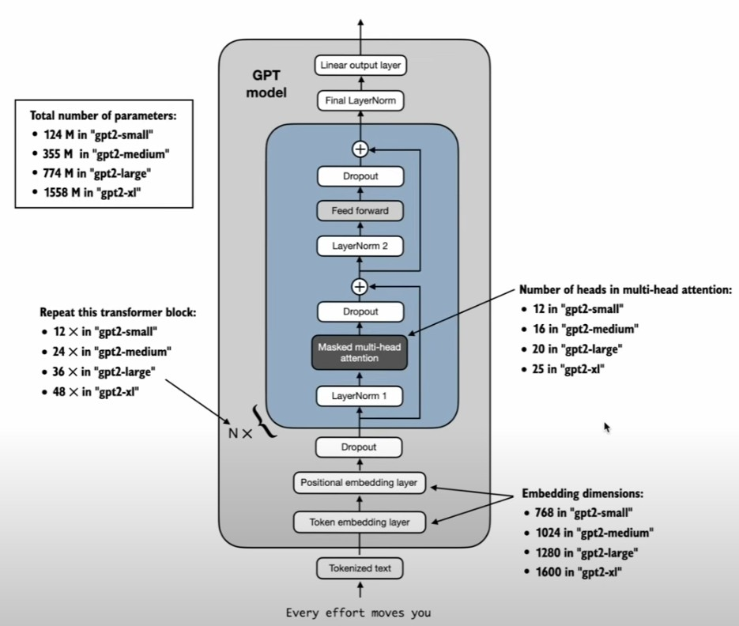

1. way of using LLm
    - via public & proprietary service
    - running custom LLM locally
    - deploy LLM and use through private API

2. stage of developing LLM
    - building
        1. data prep, sampling
        2. attention mechanism
        3. LLM architecture
    - pretraining ( foundation model)
        1. training loop
        2. model evaluation
        3. load pretrained weights
    - fine tuning
        1. data set with clas label: classifier
        2. instruction dataset: personal assistant

3. what is LLM
    - simply think as large deep neural network that predict next word
    - actually next token prediction, token by token
    - texts translated into tensor, like matrix
    - using multiple iteration to feed output as input to get output to generate full sentence, until end token
    - generate token 1 by 1, not text. token is tokenized from text
    - BPE tokenizer
        - Byte Pair Encoding
        - deal with unknown word
        - tokenized into individual character or subword, with more token
    - GPT trained with 499 billion token
    - not always more data better, leave some capacity to reasoning also good

4. LLM architecture  

5. pretraining
    - similar training like convolutional network
    - but larger scale
    - train 1-2 epoch ( or maybe not full epoch like 1.5 epoch)

6. finetuning
    - pretraining take many resource and time, usually we start from pretrained and finetune
    - preference finetuning

7. evaluateing LLM
    - MMLU: 
        - 0<x<100
        - measuring massive multitask language understanding
        - multiple choice from diverse subjects
    - ApacaEval
        - compare to gpt4
    - LMSYS chatbot arena
